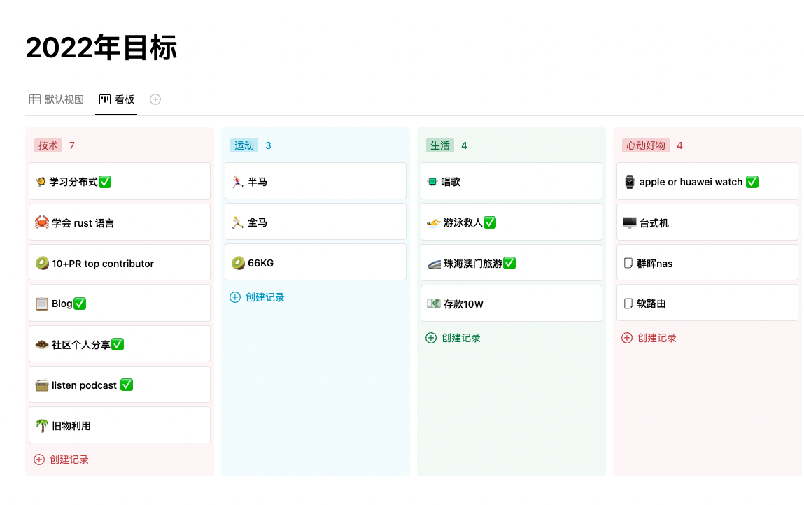
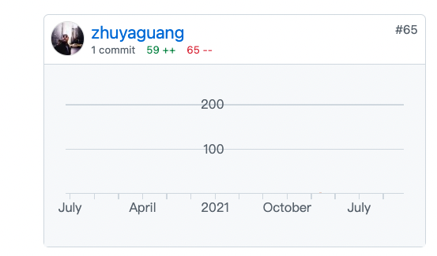
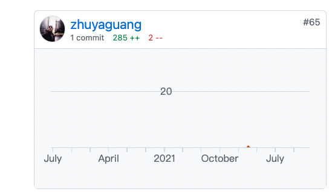
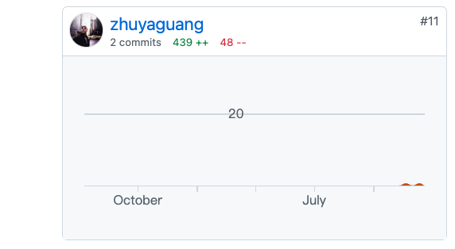
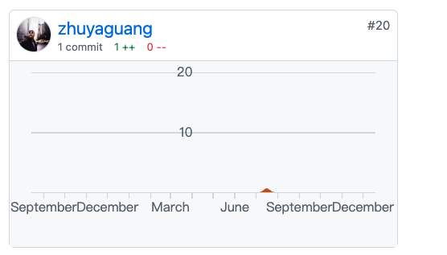
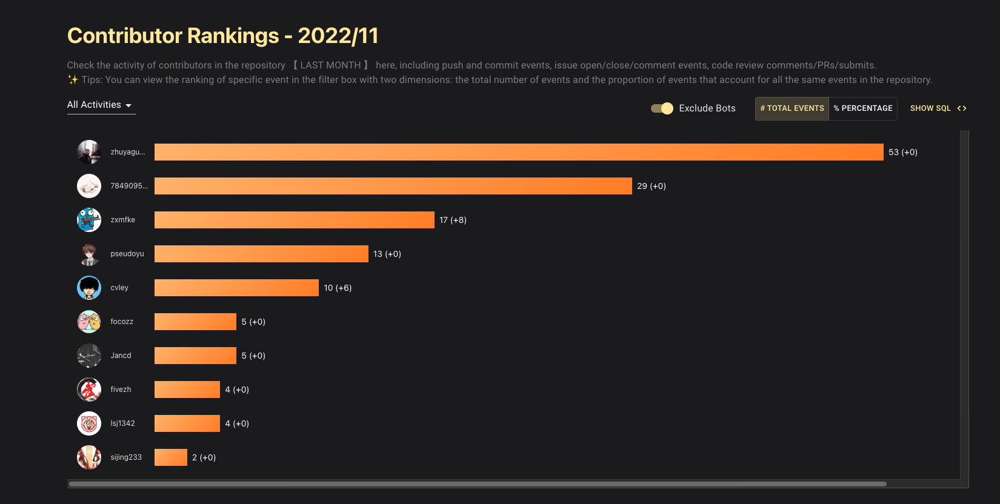
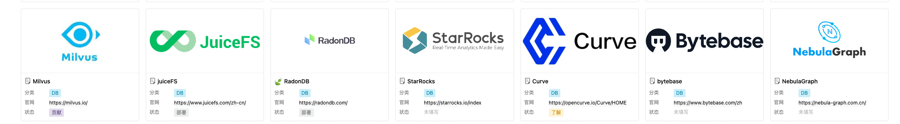
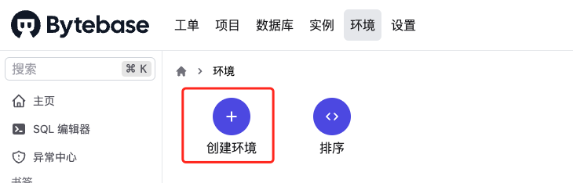
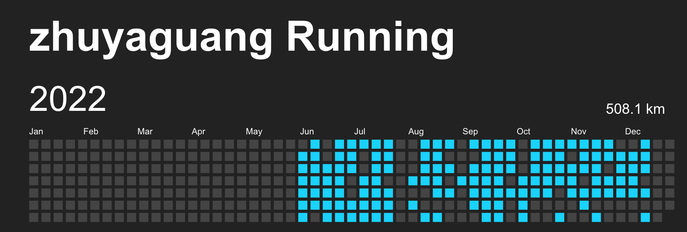
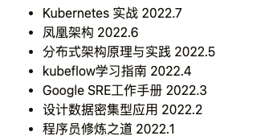

<!--more-->

达芬奇综合症指的是，不停地想学新东西，做了很多新项目，但是实际完成的很少。

更糟糕的是，你完全没有达芬奇的才华，却得了达芬奇的这种病。

2022 我好像得了这种病。

## 年终计划回顾

​	绩效答辩告一段落，大家答辩无非是自己研究了什么算法，发了多少论文，写了多少专利，做了什么项目。之江实验室作为一家科研单位，论文和专利当然是主要 KPI 。另外就是一些项目，这里的项目基本预研为主，上生产或者对标一线互联网的项目都是有不少差距。

​	所以为了对抗这种技术敏感度老化，我的解决办法就是参与开源社区，通过贡献代码来与一线互联网工程师保持技术的同步。

​	每个工作单位都有自己的要做的事，所以如何在完成工作绩效考核和技术成长之间，需要找到一个平衡点。不可能一直学新技术，做新项目，不听领导的话。也不要一直做一些对于个人技术发展没有用的事情。所以把社区最新的技术栈和领导布置任务结合起来，才是最佳选择。今年主要有 MLOps 这块领域入门了，并且加入了社区 cube-studio 。并以此为契机，给 Kubesphere 社区做了一个 meetup 闪电演讲。明年在社区活动、运营这一块需要新上一个台阶。

​	

完成的任务就不多说了，关注几个突破点吧：

1. 开源贡献方面

   向量数据库 milvus 

   https://github.com/milvus-io/milvus-docs

   

   下一代容器 WasmEdge 

   https://github.com/WasmEdge/WasmEdge

   

   星汉未来 https://github.com/galaxy-future/bridgx

   

   MLOps 平台 https://github.com/tencentmusic/cube-studio

   

   

   

2. GoCN 翻译社区拿了两次的月度最佳，贡献量总排名第二

   

https://ossinsight.io/analyze/zhuyaguang 这个网站可以看具体情况，界面十分酷炫。

## 开源回顾

​	今年虽然有疫情，但是开源社区互动还是参加蛮多的，下半年每个星期基本都去了，还带上了老婆。可以参考 `Meetup 2022` 那篇博文。

​	新的一年，要和 尹珉 一起弄一个 杭州的数据库 meetup。毕竟杭州做底层数据库的创业公司技术实力全球能排前5.

其次尝试着 用专业的角度来运营  cube-studio 社区，促进 MLOps 领域的学习和成长。

## 福利回顾（书和周边）

今年拿到的书也蛮多的。

周边也是：已经统计不过来了，下面是线上拿的部分福利，没有打勾的是2022.12.19号快递还没到的。

## 跑步

今年作为自己的跑步元年，截止12月19号，跑了500多公里。https://zhuyaguang.github.io/running_page/ 这是搭建的个人跑步主页。

跑步打卡活动 6.7.8.9.10 5个月，拿了 健身包、手环（换成了滑板）、背包、臂包、遮阳帽。

正在冲刺年度打卡第一。参加了杭州马拉松。希望自己能通过跑步，获取多巴胺和自信心。

## 读书

今年计划是读10本技术书，10本非技术书。

结果只读了**7**本技术书，现在回过头想想这些书讲了啥，有什么值得吸收的东西？发现脑子一片茫然。还是学习 微博上关注的一个大佬，用思维导读书法，总结下书的主要内容。也可以用来总结读到的论文和英文博客。

非技术书，就是享受阅读的快乐，没有什么限制了。《罪与罚》太难读下去了，但是又很想体验那种阅读后的飞升感觉。

《我的阿勒泰》《鹿川有许多粪》《江城》《黑客与画家》这四本是认认真真读完的。2023年还是读完存量书吧。多去图书馆借书。

## 电影与游戏

今年没怎么集中式看电影，搬到新家了可以搞NAS，下载下来电视里面看了。因为资源比较难找，加上看电影要照顾老婆的爱好。所以看电影前奏就很长，找电影一找就是半天。今年还是专攻大师徽章，先把今敏徽章完成。2021年度徽章完成。

游戏没怎么玩，还是不知道自己喜欢那种游戏。魂类的游戏估计费时间，又考验操作。比如只狼，对马岛之魂。

美国世界末日也不错。双人成行老婆估计不感兴趣。所以一直没买PSN的会员。

## 2023 规划

* 可观测性与多集群

* rust

* eBPF https://mp.weixin.qq.com/s/5kGaFHgQqDKmmVDyZ-PGVQ

* 图数据库、知识图谱、图计算工程化落地与专利输出

* 社区深度参与

* 还清除房贷以外所有债务。（10W）

  
  
  

