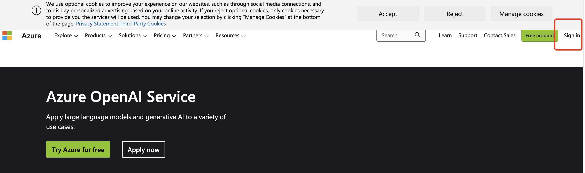

<!--more-->

## 第一步：注册Azure

注册地址：[Azure 国际版](https://azure.microsoft.com/en-us/products/cognitive-services/openai-service?WT.mc_id=DT-MVP-5003133)

>  我是用 GitHub 注册的,注册完绑定一张 [visa 信用卡](https://signup.azure.com/signup?offer=ms-azr-0044p&appId=102&ref=&redirectURL=https:%2F%2Fazure.microsoft.com%2Fget-started%2Fwelcome-to-azure%2F&l=zh-cn)

## 申请 openAI service 

[申请链接](https://customervoice.microsoft.com/Pages/ResponsePage.aspx?id=v4j5cvGGr0GRqy180BHbR7en2Ais5pxKtso_Pz4b1_xUOFA5Qk1UWDRBMjg0WFhPMkIzTzhKQ1dWNyQlQCN0PWcu)

>  就一五一十填写，地址填中国也没关系，公司邮箱填 zhejianglab.com 那个邮箱，公司域名填  https://www.zhejianglab.com/

* 开通之后默认是 3.5 ，如果想用 GPT4 的话，要单独申请。

[GPT4申请链接](https://customervoice.microsoft.com/Pages/ResponsePage.aspx?id=v4j5cvGGr0GRqy180BHbR7en2Ais5pxKtso_Pz4b1_xURjE4QlhVUERGQ1NXOTlNT0w1NldTWjJCMSQlQCN0PWcu)

整个流程也可以参考下面博客：

[使用 Azure OpenAI 打造自己的 ChatGPT ](https://www.cnblogs.com/stulzq/p/17271937.html)

[Azure OpenAI Service 注册申请与配置心得](https://atlassc.net/2023/04/25/azure-openai-service)

## 使用

### 文档

[快速入门：开始使用 Azure OpenAI 服务生成文本](https://learn.microsoft.com/zh-cn/azure/cognitive-services/openai/quickstart?tabs=command-line&pivots=programming-language-python)

[杭州超普&微软 Azure OpenAI线上会议](http://s6e.cn/AYtG3)

## 支持 Azure openAI API

现在很多开源项目都支持 openAI 的API，不支持 Azure openAI API，有几个办法解决。

1. 通过 proxy 项目解决，例如 https://github.com/stulzq/azure-openai-proxy
2. 通过 cloudflare 代理解决，例如 https://github.com/haibbo/cf-openai-azure-proxy
3. 通过修改源码解决，这个方案不通用，每个项目改的地方都不一样，需要去 issue 里面找办法。例如  [Azure修改源码支持](https://github.com/Yidadaa/ChatGPT-Next-Web/issues/371)

### Microsoft build 

