<!--more-->

## Bytebase 介绍

Bytebase 官网的 slogan是： 面向开发者 可靠的 数据库 CI/CD。把数据库 和 DevOps 结合起来了。这对于 DBA 来说确实是一个福音。

作为一个开发之前部署了 mysql ，调试的时候想去看看数据库的数据，通常都是下载一个 Navicat。但是不同的电脑需要下载不同的版本，而且还是收费的，去找破解版的话，又要折腾一番。有没有浏览器就能用的开源的数据库可视化管理产品呢。

Bytebase 他来了！审核，变更，留档，回滚。源自 Google 的数据库 DevOps 最佳实践。

## Bytebase 安装

安装很简单，一个命令

~~~~shell
docker run --init \
  --name bytebase \
  --restart always \
  --publish 5678:8080 \
  --health-cmd "curl --fail http://localhost:5678/healthz || exit 1" \
  --health-interval 5m \
  --health-timeout 60s \
  --volume ~/.bytebase/data:/var/opt/bytebase \
  bytebase/bytebase:1.9.0 \
  --data /var/opt/bytebase \
  --port 8080
~~~~

然后 http://IP:5678/ 就可以直接访问了。

如果你有数据库实例的话，那你可以连接你自己的数据库实例。如果没有的话，可以自己创建一个，也是一条命令。

~~~shell
docker run --name mysqldtest   --publish 3307:3306   -e MYSQL_ROOT_HOST=172.17.0.1   -e MYSQL_ROOT_PASSWORD=testpwd1   mysql/mysql-server:8.0
~~~

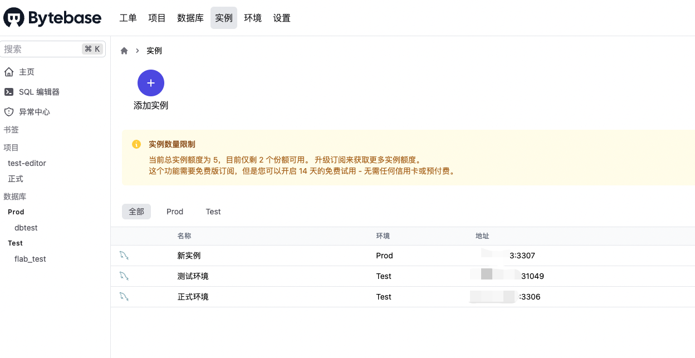

Bytebase 主界面如上图所示，主要是区分环境（测试环境、生产环境），环境里面有实例，实例里面包括了数据库。项目则是一个逻辑概念，包含了你自己的业务需要处理哪些数据库和处理记录。

### 创建环境

首先我们去创建环境，默认已经创建好了两个环境，在不同的环境可以定义不同的审批策略和备份策略。

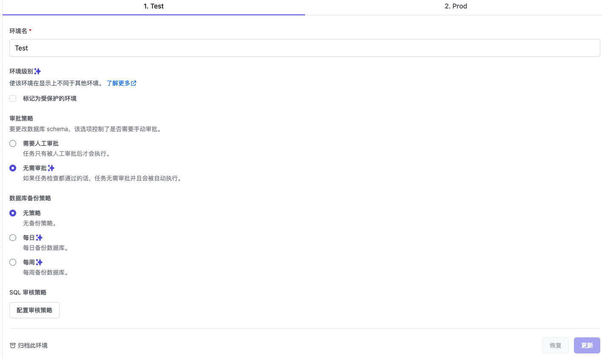

### 添加实例

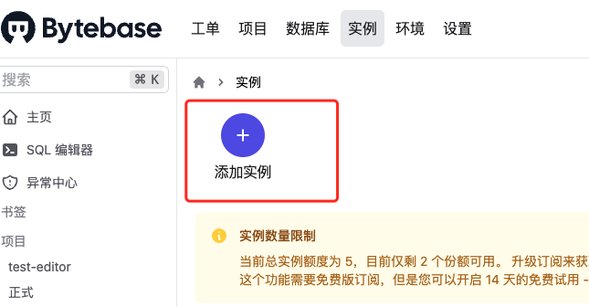

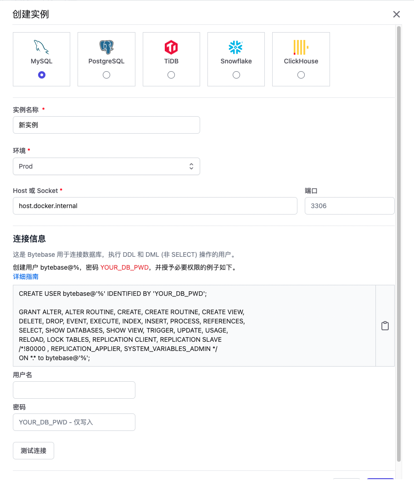

填入必要的参数就可以将数据库实例接入进来。

### 新建项目

新建好项目之后，就可以通过创建数据库或者转移数据库，来对想要操作的数据库进行，增删改查操作了。

## 体验SQL 编辑器

### 创建表

* 左侧选择数据库实例，创建表 t3 ，有 SQL 语句补全功能很赞！

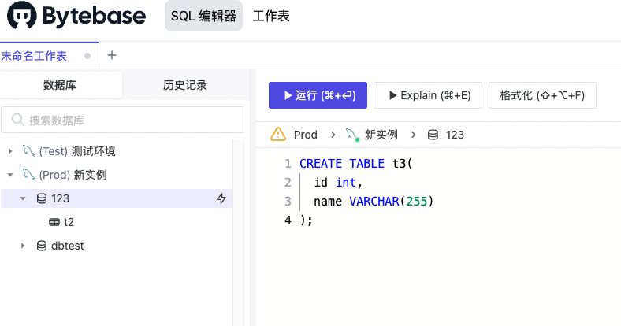

* 点击运行，由于是生产环境的实例，所以只能执行 SELECT 语句，不过可以提交工单审批来创建表，点击 变更 Schema

* 创建工单

* 等待批准

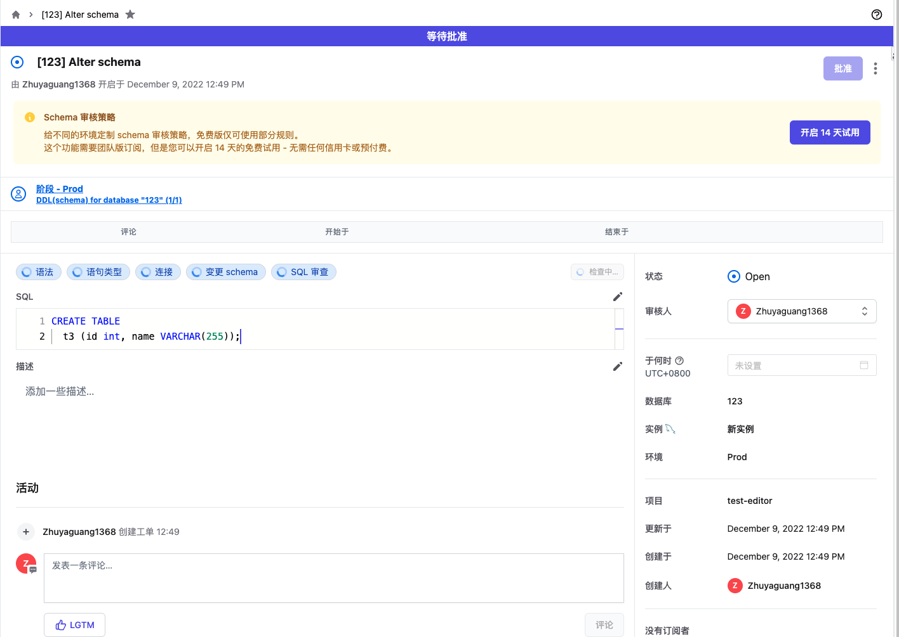

* 由于我是 **Owner（工作空间所有者）** 所以我可以审批，点击批准

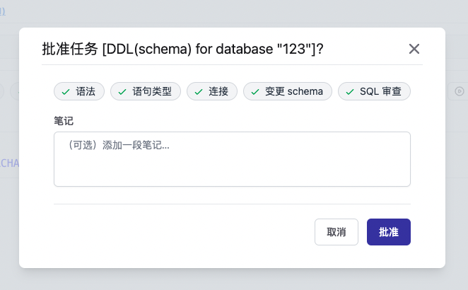

* 成功创建 t3 表

### 插入表

向 t3里面插入一条数据

⚠️：这里有一个注意地方，数据库名字一般不要用数字开头，不然的话插入数据要用 单引号 ` 扩起来。另外Bytebase 也会在审批的时候校验你的 SQL 语法，这点对于不熟悉 SQL 语法的开发来说还是很赞的！

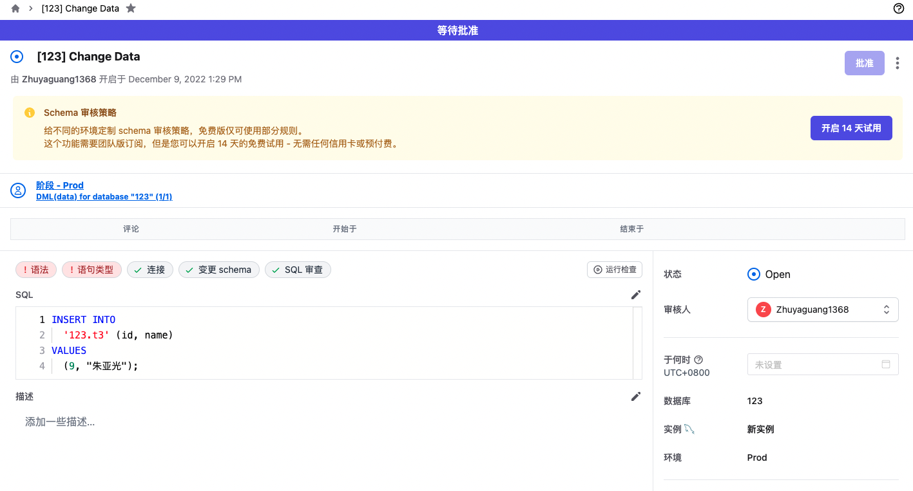

### 查询表

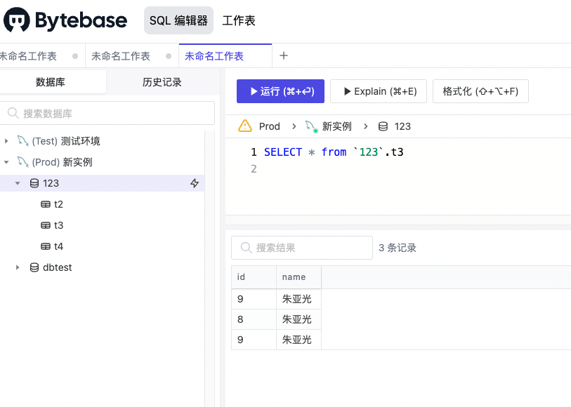

### 管理员模式

如果嫌审批太麻烦的话，可以使用管理员模式

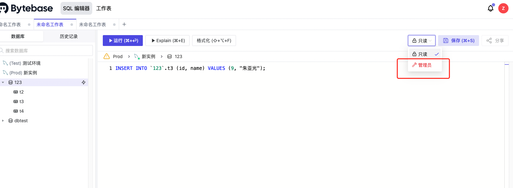

直接命令行操作

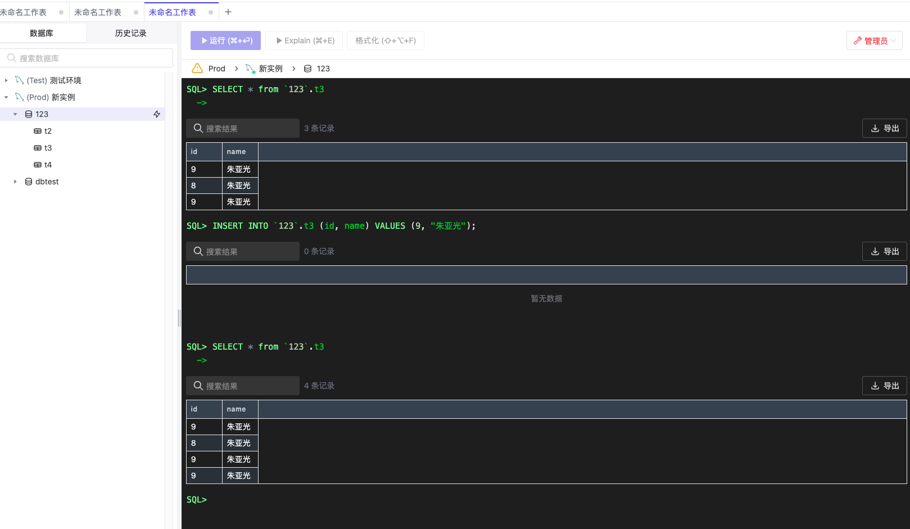
