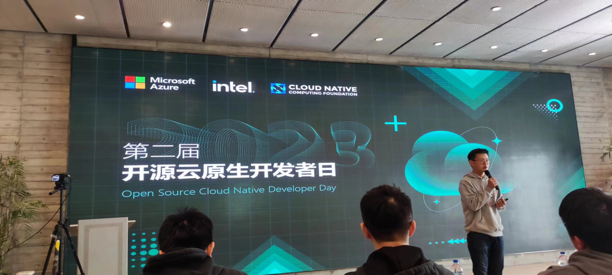

# meetup 2023

<!--more-->

# 线下

## 3.11 寻找 Milvus 的第 N+1 种可能

[寻找 Milvus 的第 N+1 种可能](https://mp.weixin.qq.com/s/ZVhAh6hUNpEAAFXLk_oLYw)

## 4.8 第二届开源云原生开发者日

## 5.20 JuiceFS 在大规模 AI 训练、大模型中的应用

[JuiceFS 在大规模 AI 训练、大模型中的应用](https://mp.weixin.qq.com/s/1S1ukT-WfnvqtEf4VfgECg)

## 6.3 云原生 Meetup 杭州站

第三次参加了，第一次认识人，第二次当讲师，第三次来帮忙。

[精彩回顾](https://mp.weixin.qq.com/s/KQLW1uXDDhmfgxnKTVm8Ng)

## 6.10 全球人工智能技术大会

会场离我家很近，花了两块钱坐公交车去的，提了两个问题。

第一个问题是问 卿老师 关于 基于国外大模型接口的AI应用的安全与法规问题。

第二个是问了 李戈 老师 关于 AI native 应用的形态是什么样的。

最后 唐杰老师的报告十分精彩，哈哈！

王怀民院士谈开源

## 6.30 孙凝晖院士，智能计算技术的发展

## 7.1 阿里云用户组

来了三墩的阿里云总部

## 7.7 全球人工智能大会

上海 大模型展销会

## 7.22 云边数据智能

[云智能数据的无限未来 - Greptime 首次参办的线下技术沙龙精彩回顾](https://mp.weixin.qq.com/s/iBQJnPV16QxTNFZJO6N8wA)

## 8.5 开源数据库技术沙龙杭州站

[活动预告](https://mp.weixin.qq.com/s/Z_MXuo9v105TEZNic8FRSg)

# 线上

2023 北京智源大会

https://2023.baai.ac.cn/schedule

2023 全球人工智能技术大会

https://www.itdks.com/Home/mobile/topic_detail?id=403

