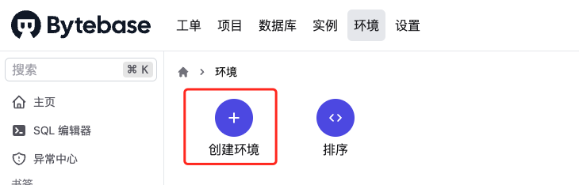
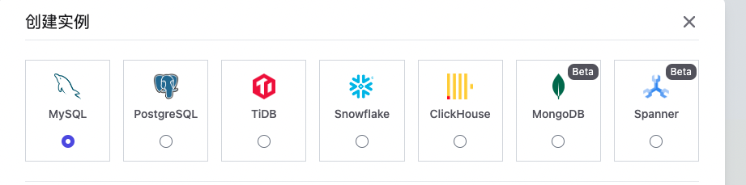
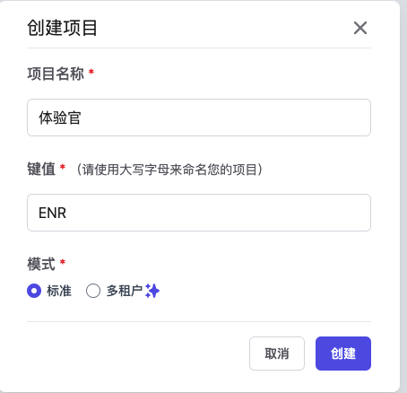
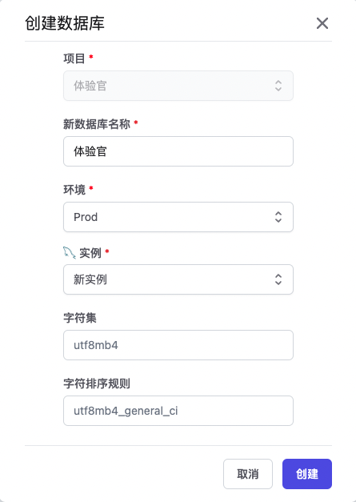
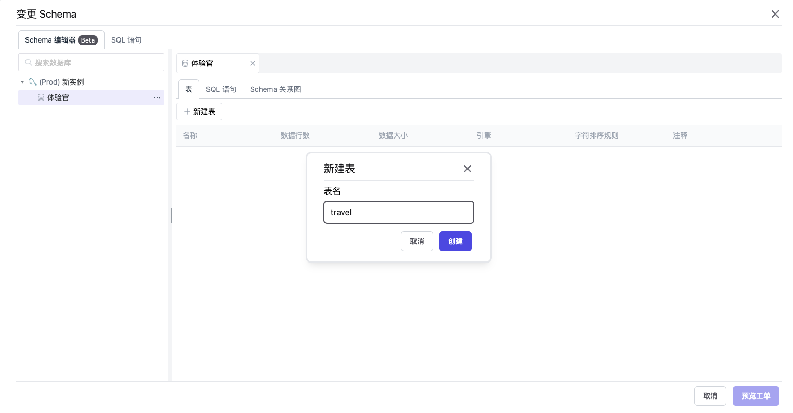
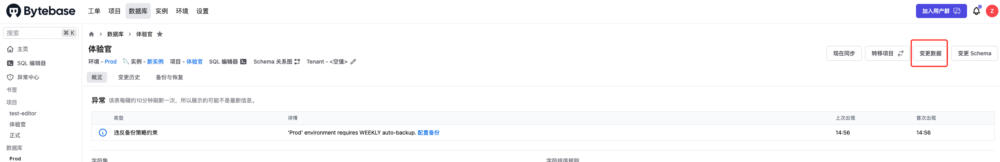
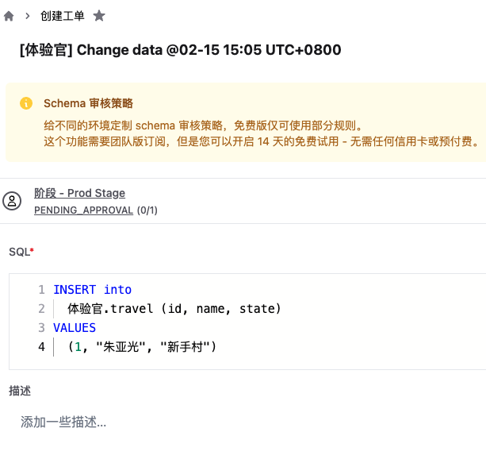
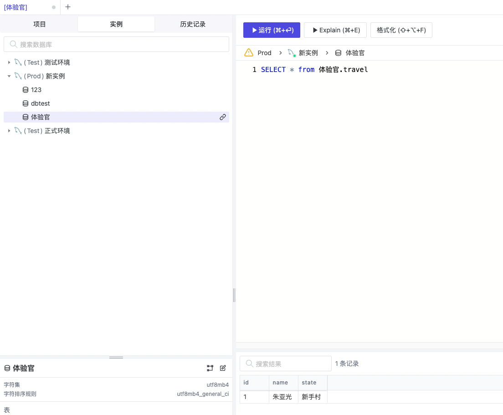

# Bytebase 体验官之勇闯新手村


<!--more-->

# Bytebase 体验官之勇闯新手村

作为一个后端开发，看到微信群里一直在传要干掉 DBA 。于是我踏上了 Bytebase 体验官之旅。想看看 DBA 的尽头是什么。

## 个人信息

* 朱亚光
* 之江实验室云原生爱好者
* [GitHub 地址](https://github.com/zhuyaguang)


## 安装环境

体验官当然是要安装最新的 1.12.0 版本啦

```shell
docker run --init \
  --name bytebase \
  --restart always \
  --publish 5678:8080 \
  --health-cmd "curl --fail http://localhost:5678/healthz || exit 1" \
  --health-interval 5m \
  --health-timeout 60s \
  --volume ~/.bytebase/data:/var/opt/bytebase \
  bytebase/bytebase:1.12.0 \
  --data /var/opt/bytebase \
  --port 8080
```

然后 http://IP:5678/ 就可以直接访问了。


安装 mysql 实例

```shell
docker run --name mysqldtest   --publish 3307:3306   -e MYSQL_ROOT_HOST=172.17.0.1   -e MYSQL_ROOT_PASSWORD=testpwd1   mysql/mysql-server:8.0
```


## 准备环境

* 登录 Bytebase ，首先我们创建环境。



* 根据环境，创建 mysql 实例



* 创建项目

  

* 创建数据库

  

## 先写后读

我们创建了一个 “ 体验官” 的数据库之后，开始新建一个 “travel” 表，往这里面写点数据。



创建完表结构，点击，“变更数据”，加点数据进去。当然也可以使用 SQL 编辑器。





插入一条数据




利用 SQL 编辑器完成一次查询





这样就完成了新手村任务，不到半个小时。是不是很方便。

## 体验感悟

这是我第二次写体验报告了，我直接把 1.9 版本的 Docker 实例杀掉了。安装 1.12.0 版本。意外的是之前的数据都还在。所以版本升级还是挺安全的。

首先，我没有参考新手指南。整个流程走下来相当丝滑。只要理解 **环境 实例 数据库 项目** 这几个概念就行。

而且每个步骤都有工单记录，操作起来很放心。

