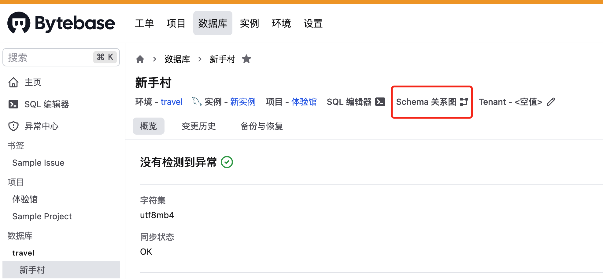
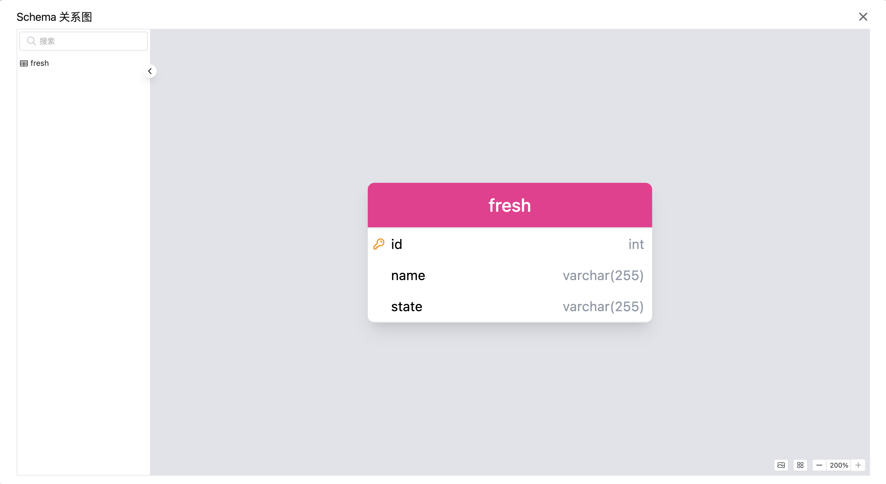
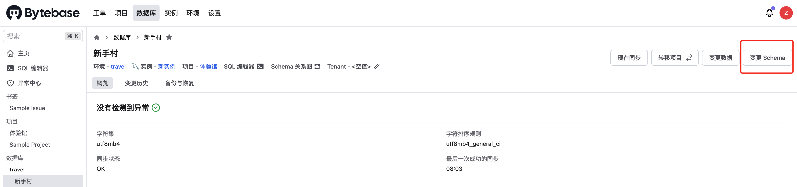
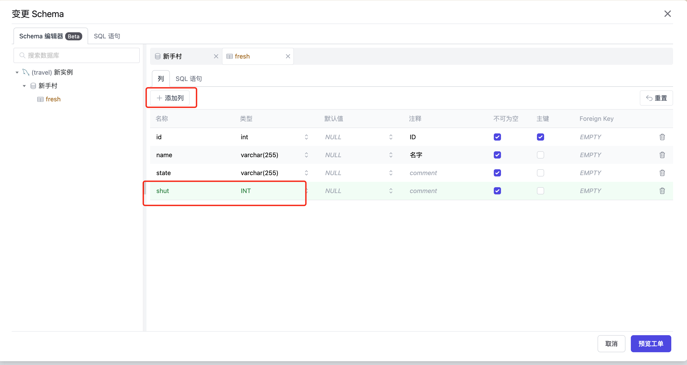
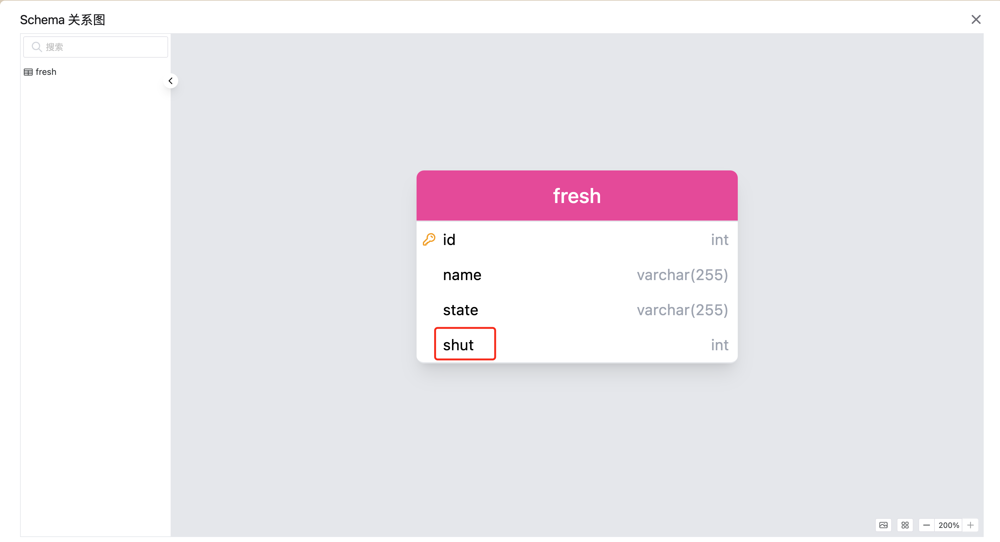

# Bytebase 体验官之狂飙的 ChatGPT


<!--more-->

## Bytebase 体验官之狂飙的 ChatGPT

### 个人信息

- 朱亚光
- 最近在研究大模型的Prompt Engineer 
- [GitHub 地址](https://github.com/zhuyaguang)

### **Schema 变更**

开启今天的体验官之旅之前，先回忆下我们上期在新手村学到的内容：

```
1.安装环境 
2.创建 mysql 实例 
3.创建项目 
4.创建数据库，建表
5.插入数据并查询
```

详细内容可查看 [Bytebase 体验官之勇闯新手村](https://zhuyaguang.github.io/bytabase2/)

当然要走出新手村靠以上这点基本功是不行的，今天我们要学习  **Schema 变更** 这个必杀技。

那什么是  **Schema 变更** 呢，之前我们上期创建了一张表，写入了一条数据。

| id   | name   | state  |
| ---- | ------ | ------ |
| 1    | 朱亚光 | 新手村 |

现在我想记录下我的体验官之旅到了第几关了，加了 shut 这一列。

| id   | name   | state  | shut |
| ---- | ------ | ------ | ---- |
| 1    | 朱亚光 | 新手村 | 2    |

那 Bytebase 里面怎么操作呢？

我们先看看 Schema 关系图






那我们直接点击变更 **Schema** 



然后 **添加列** shut ,选择 INT 类型




然后就成功 变更了 Schema





是不是很简单！

那今天的题目和狂飙和 ChatGPT 有什么关系呢

Bytebase 针对具体业务场景，初步集成了 ChatGPT 的功能，在使用 Bytebase 过程中遇到不会写的 SQL 语句。直接问 AI 小助手了。

我把我体验的过程，做了一个[小视频](https://xie.infoq.cn/article/432f88db614513217a520bf9f)，欢迎大家收看。


