# 向量检索落地场景探索

<!--more-->

### 向量检索落地场景探索

Zilliz 公司理念：以重新定义数据科学为愿景，致力于打造一家全球领先的开源技术创新公司，并通过**开源和云原生解决方案为企业解锁非结构化数据的隐藏价值**。

### Milvus 在微博内容风控特征工程体系中的实践

#### 背景需求

* 同质化内容恶意营销
* 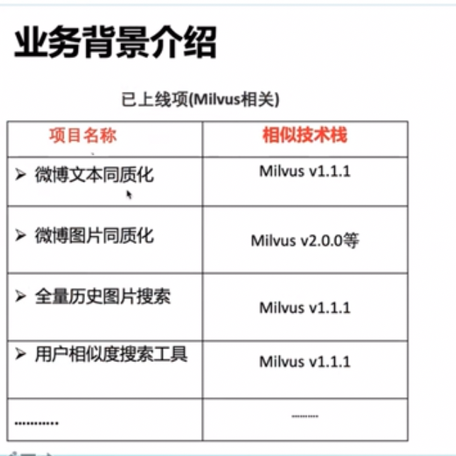

#### 架构设计

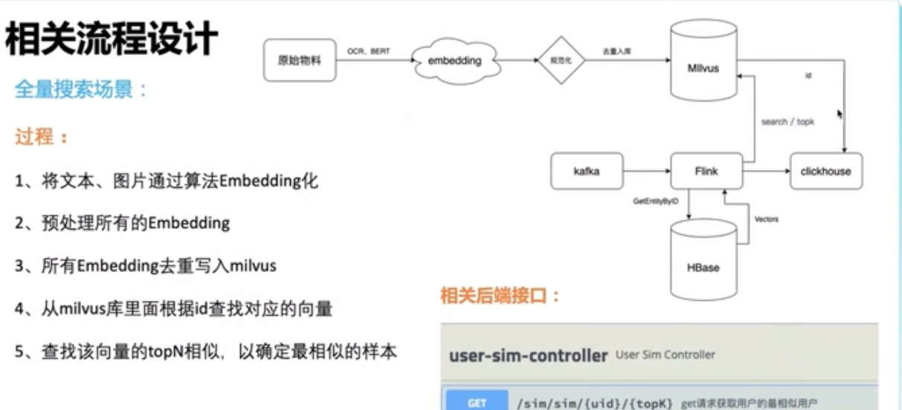

#### 原文链接

[Milvus 在微博内容风控特征工程体系中的实践](https://www.bilibili.com/video/BV17Y411G7cB?spm_id_from=333.999.0.0)

### 爱奇艺在线向量召回工程服务化实践

#### 背景需求

* 提高工程化效率

  如果向量召回服务没有通用化与服务化，则不同业务的算法与系统开发工程师各自需要重复搭建。

  对于一个公司的推荐服务来说，会服务多个业务，因此把向量检索服务的**搭建与运维简易化、自助化、自动化以及平台化** 显得非常重要。

#### 架构设计

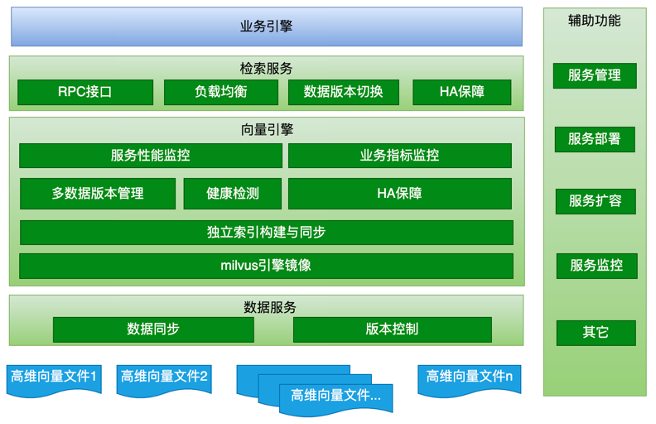

### PaddleNLP 基于 Milvus 的开源语义检索应用实践

#### 应用背景

1.视频推荐

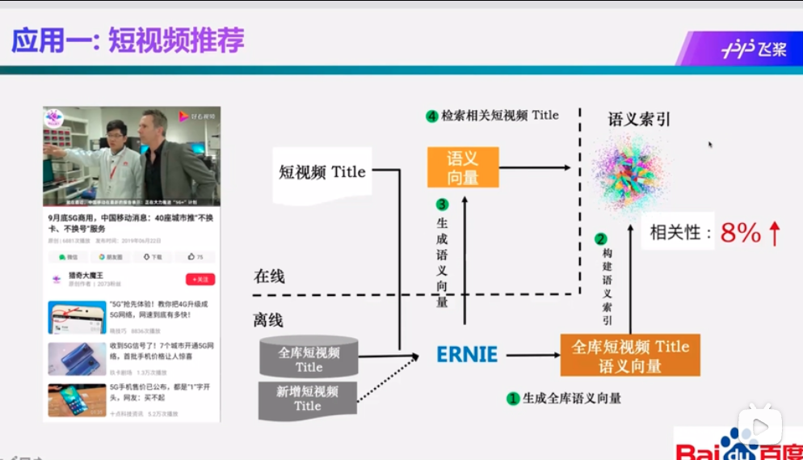

2.百度搜索

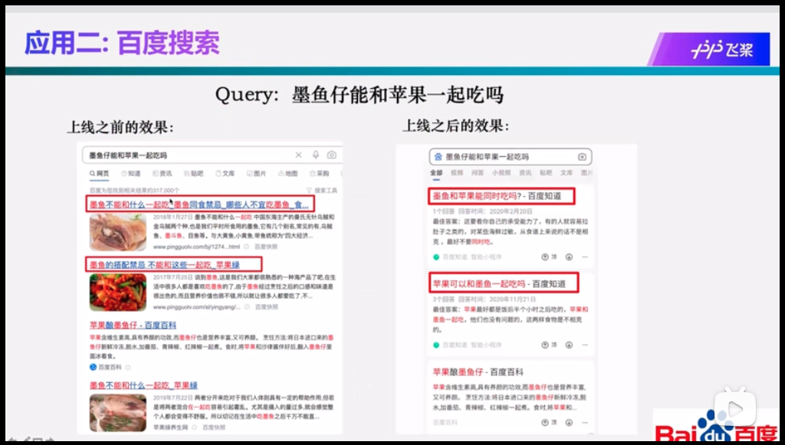

3. 文献语义检索

   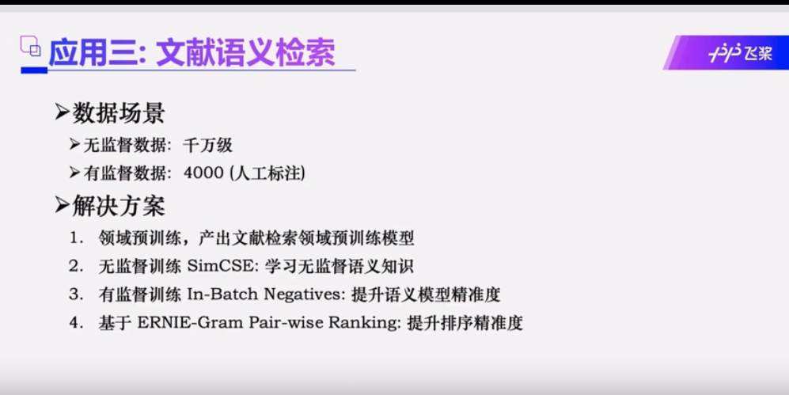

#### 架构设计

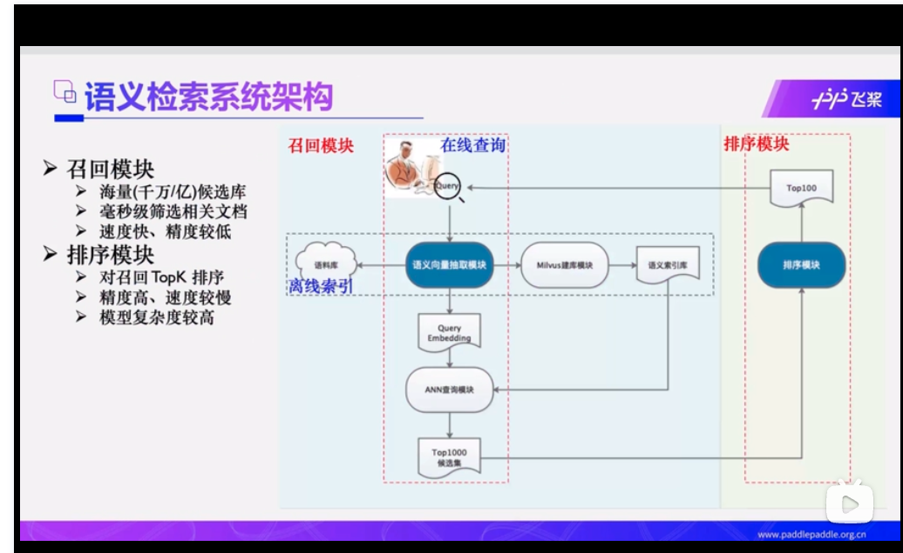

#### 百度开源的语义检索系统四大优势

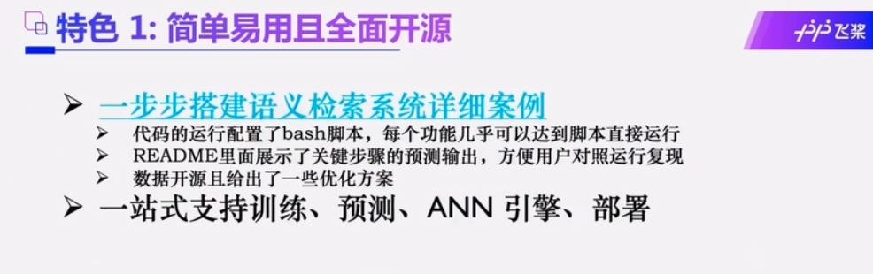

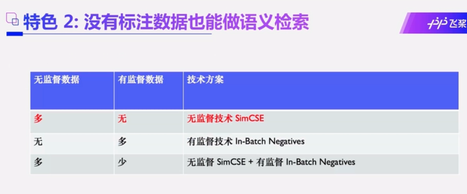

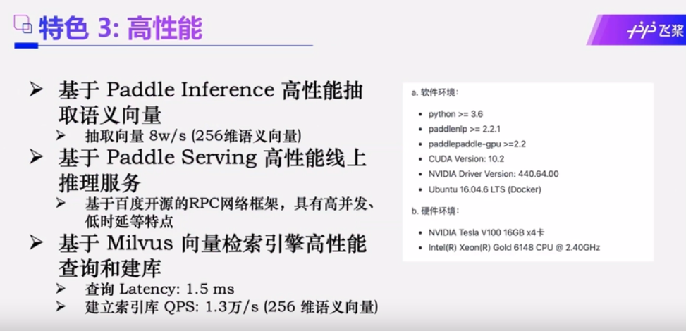

 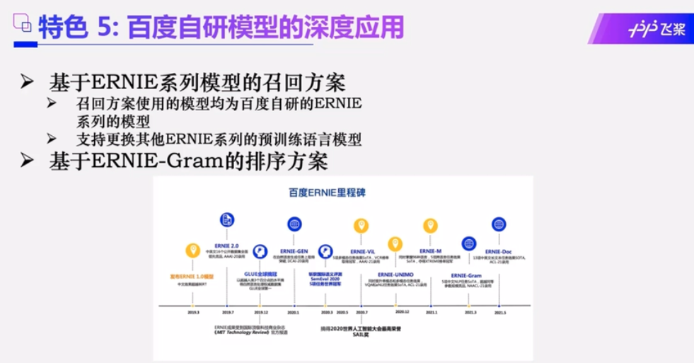

#### 开源实现

[动手搭建一套语义检索系统-学术文献检索](https://aistudio.baidu.com/aistudio/projectdetail/3351784?channelType=0&channel=0)

基于PaddleNLP搭建一套完整的文献检索系统，包括召回，排序，Milvus召回系统等。

#### 原文链接

### 快手向量近似计算实践

#### 背景需求

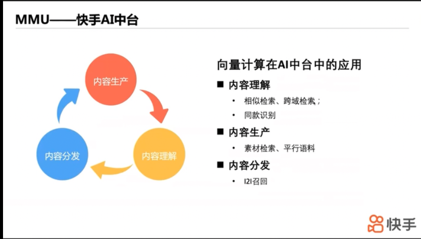

#### 架构设计

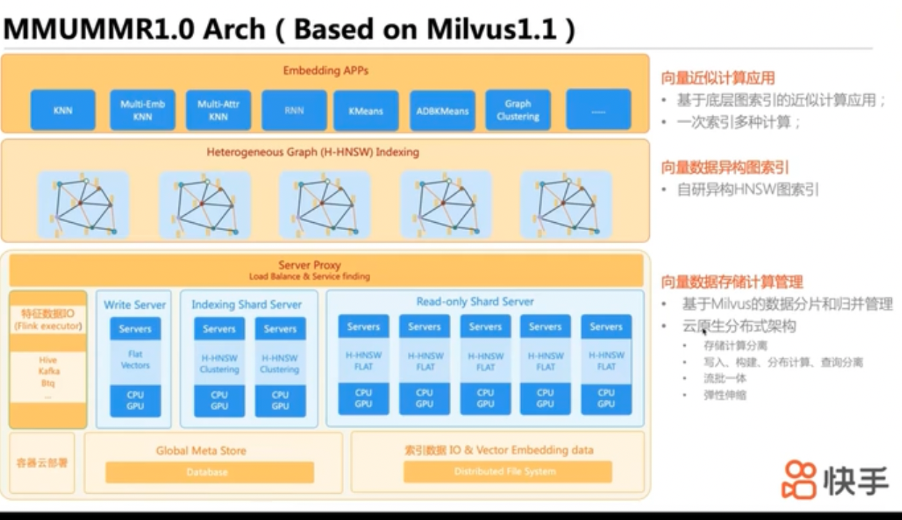

#### 自研索引算法

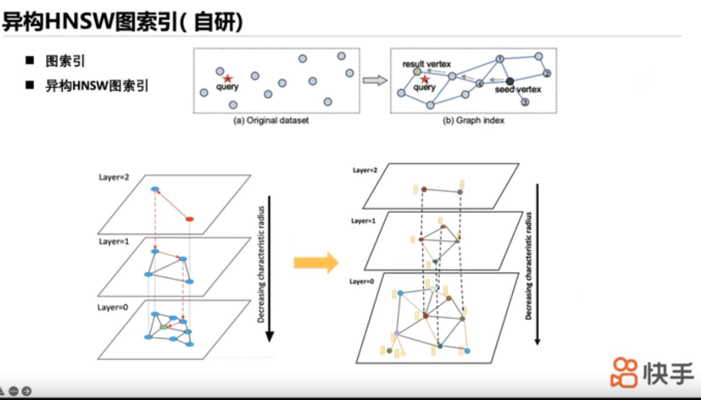

#### KNN检索（复合索引）

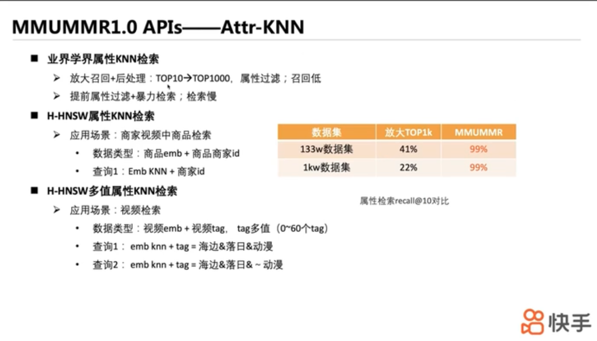

#### 原文链接

[快手向量近似计算实践](https://www.bilibili.com/video/BV1444y1p7c8?spm_id_from=333.999.0.0)

### Milvus 在思必驰问答系统中的应用

#### 架构设计

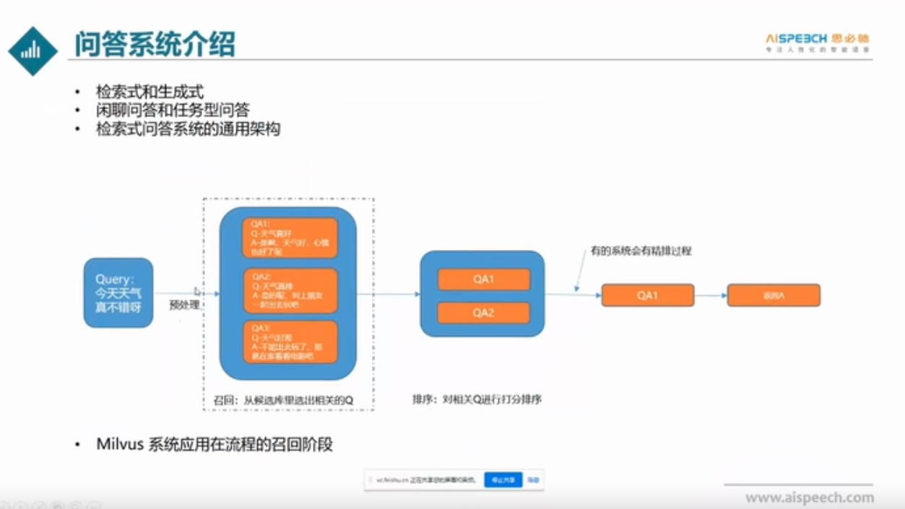

#### Milvus应用

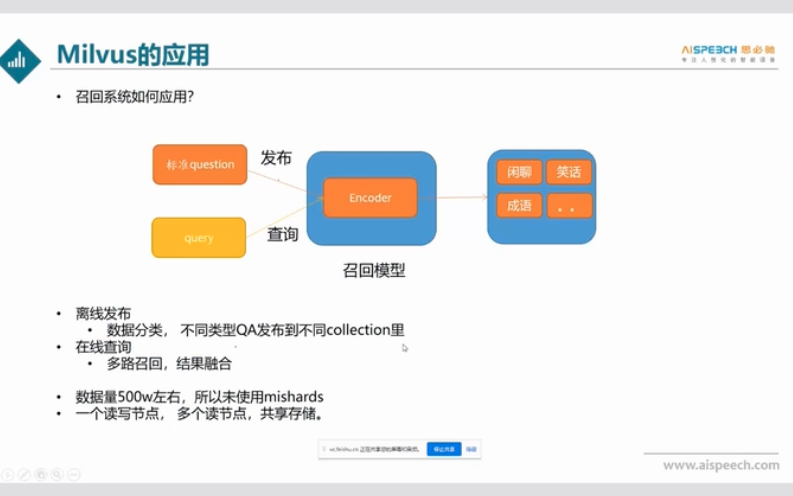

### milvus 在家居行业的应用

#### 背景需求

用户可以自己画图，然后检索家具。

#### 架构设计

#### 资源存储

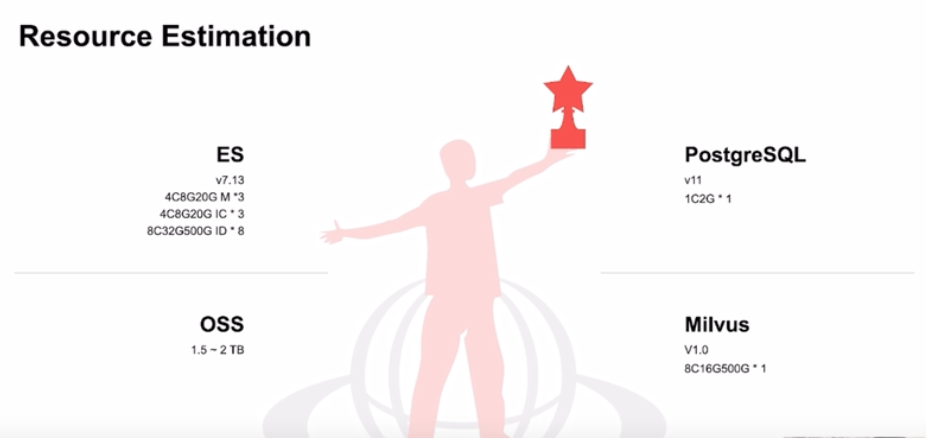

#### 原文链接

[元宇宙到家，那些“聪明”的设计工具 Zilliz](https://www.bilibili.com/video/BV1v44y1J7Ts?spm_id_from=333.999.0.0)

### vivo 短视频基于 Milvus 的内容去重实践

#### 业务背景

内容去重

难点：亿级样本数据、百万级吞吐、兼顾精度召回

#### 算法流程设计

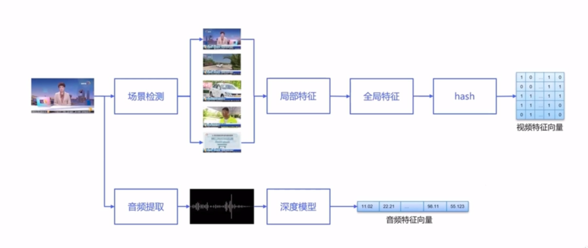

#### 架构设计

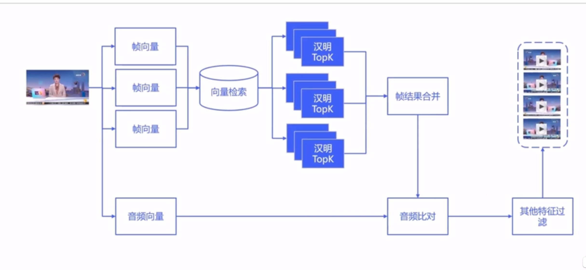

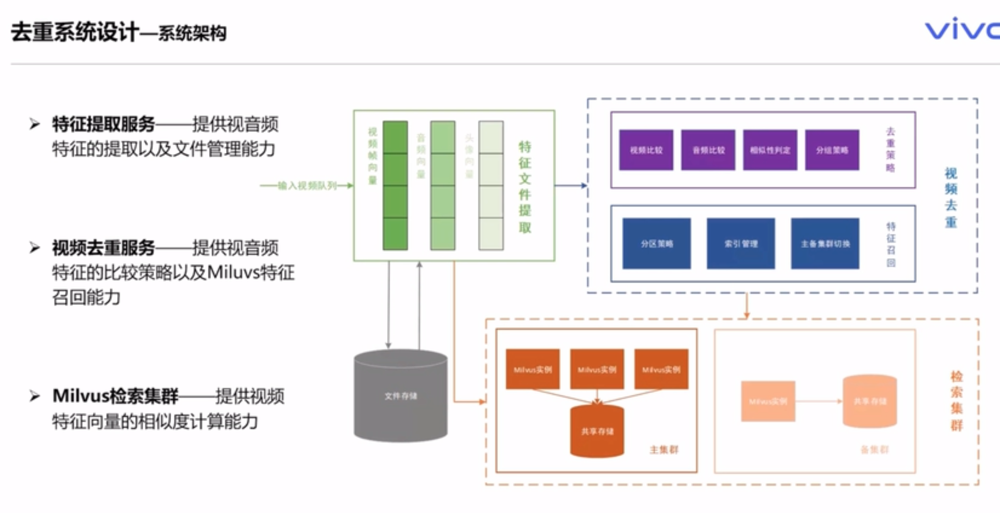

### 总结

针对上面众多案例，我们的向量检索落地场景可以概括为下面几个方面：

1.针对企业的AI应用服务，搭建一套向量检索引擎服务。让向量检索系统 运维简易化、自助化、自动化以及平台化。企业的AI应用有推荐、智能问答、视频检索、分子检索、NLP等。

2.我们提供了软件、硬件、算法全链路的解决方法，可以针对用户不同的场景端到端进行支持。

[Milvus实战系列](https://space.bilibili.com/478166626/channel/seriesdetail?sid=2050872)

